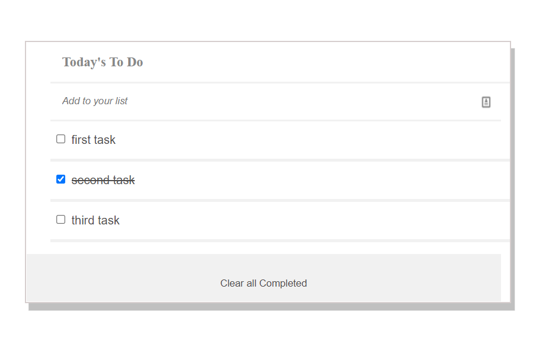

# To Do List

> To DO List Project: Add,Remove and Update and make Marks all complete your daily task.

## Built With

- html, css, js, ES6
- Install webpack
- Eslint, StyleLint

## Screenshot Demo

## Live Demo (if available)

[Live Demo Link](https://ifzarasool.github.io/To-Do-List/)

## Getting Started

To get a local copy up and running follow these simple example steps.

### Prerequisites

`node and npm`

### Setup

`git clone <repo>`

### Install

`npm install`

### Usage

`run npx build`

## Authors

👤 **Ifza Rasool**

- GitHub: [@IfzaRasool](https://github.com/IfzaRasool)

## 🤝 Contributing

Contributions, issues, and feature requests are welcome!

Feel free to check the [issues page](../../issues/).

## Show your support

Give a ⭐️ if you like this project!

## Acknowledgments

- Hat tip to anyone whose code was used
- Inspiration
- etc

## 📝 License

This project is [MIT](./MIT.md) licensed.
